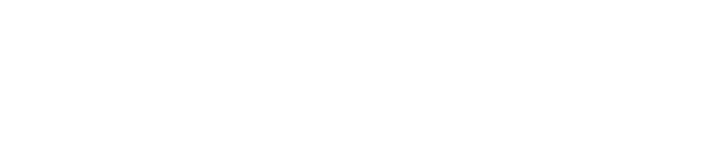
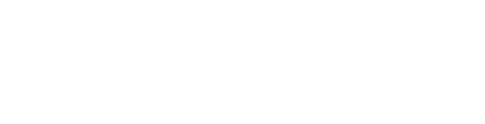
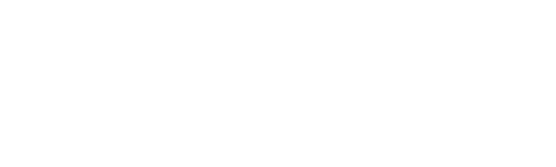

# Capa de PDF — código exato validado

Pressupõe a arquitetura de [`print-pages.md`](print-pages.md) (`.gh-page`
fixa 210×297mm, `@page { margin: 0 }`). Validado com o usuário em agosto de
2026 — o que muda de um documento para outro é só o **título** e o
**subtítulo**; o resto (fundo, moldura, logo, rodapé da capa) é fixo, copie
sem alterar.

## O que é

Fundo **sólido** `--logo-purple` (`#613EFF`, o fill exato da nova logo;
ver `palette.md`), sem gradiente, sem onda
decorativa. Moldura arredondada fina inset 10mm. Logo Gov Hub branca **no
fluxo normal**, alinhada à esquerda junto com o resto do texto (não
posicionada solta no canto) — direto acima do título, sem kicker entre os
dois (testado com kicker antes; removido a pedido do usuário por ser
redundante com o título). Título e subtítulo em branco. Rodapé da capa:
logos dos parceiros institucionais, centralizadas.

## CSS

```css
.gh-cover { background: var(--logo-purple); color: #fff; }

.gh-cover__border {
  position: absolute; inset: 10mm;
  border: 2.5px solid rgba(255,255,255,0.55);  /* fina e discreta, não branco sólido */
  border-radius: 24px;
  pointer-events: none;
}

.gh-cover__logo {
  display: block;
  height: 40px; width: auto;
  margin-bottom: 52px;                          /* respiro antes do título */
}

.gh-cover__content {
  position: absolute; left: 20mm; right: 20mm; top: 50%;
  transform: translateY(-30%);                  /* bloco de texto um pouco acima do centro vertical */
}

.gh-cover__title {
  color: #fff;  /* explícito, não confie na herança de .gh-cover — um reset
                   global tipo h1,h2,h3,h4{color:...} no projeto que consome
                   esta skill sobrescreve silenciosamente o branco herdado */
  font-size: 38px; font-weight: 800; line-height: 1.12;
  margin: 0 0 18px; max-width: 15ch;
}

.gh-cover__subtitle {
  font-size: 14px; line-height: 1.55; max-width: 60ch; opacity: .92;
}

.gh-cover__footer {
  position: absolute; left: 20mm; right: 20mm; bottom: 16mm;
  display: flex; align-items: center; justify-content: center;
  gap: 28px;
}
.gh-cover__footer img { height: 22px; width: auto; }
```

## HTML

```html
<div class="gh-page gh-cover">
  <div class="gh-cover__border"></div>
  <div class="gh-cover__content">
    
    <h1 class="gh-cover__title">Título do documento em uma ou duas linhas</h1>
    <p class="gh-cover__subtitle">Subtítulo de uma frase explicando o documento.</p>
  </div>
  <div class="gh-cover__footer">
    
    
  </div>
</div>
```

As imagens `logo/parceiros/lab-livre.png` e `logo/parceiros/unb.png` já são
versões brancas (fundo transparente), prontas para fundo sólido colorido —
não precisam de nenhum tratamento adicional. **Ordem fixa: Lab Livre
primeiro, UnB depois.** Copie a pasta `references/logo/` inteira (incluindo
`logo/parceiros/`) para o projeto, como de costume (ver `print-pages.md`).
Os ícones não são copiados — vêm por CDN (ver `icons-catalog.md`).

## O que varia por documento

- **Título** (`.gh-cover__title`): nome do documento. `max-width: 15ch` já
  força quebra de linha em títulos longos — teste com 2-3 linhas antes de
  aumentar a largura.
- **Subtítulo**: uma frase, `max-width: 60ch`.

## O que não varia (não mexa sem motivo)

Cor de fundo, espessura/opacidade da moldura, tamanho e posição da logo, o
rodapé da capa (logos dos parceiros, centralizadas, nessa ordem) — já
testados e aprovados. **Sem kicker** — foi removido por ser redundante com
o título; não reintroduza sem pedido explícito do usuário.

**Cuidado com o nome:** esse rótulo pequeno em uppercase acima do título
(o "kicker") é o mesmo tipo de elemento chamado de **eyebrow** no
cabeçalho de capítulo (`.gh-band__eyebrow`, ver `print-header.md`) — lá
ele é obrigatório, aqui na capa é proibido. Já aconteceu de um agente
reintroduzir o kicker na capa sob o nome "eyebrow" (`.gh-cover__eyebrow`,
com um texto tipo "Documentação de schema · dados abertos" acima do
título), achando que era um elemento diferente por ter outro nome de
classe — é o mesmo elemento proibido. A capa validada vai direto de
`.gh-cover__logo` para `.gh-cover__title`, sem nenhum texto pequeno entre
os dois, com qualquer nome de classe.
