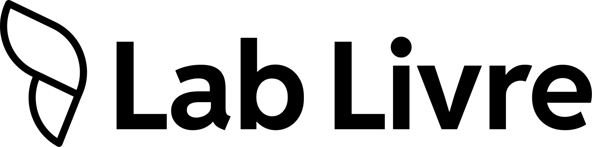
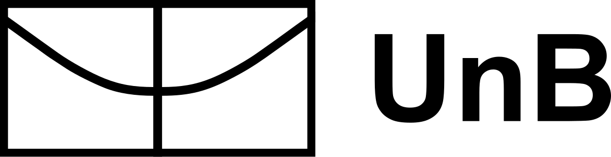

# Capa de PDF — código exato validado

Pressupõe a arquitetura de [`print-pages.md`](print-pages.md) (`.gh-page`
fixa 210×297mm, `@page { margin: 0 }`). Validado com o usuário em
2026-09-17, na simulação do Relatório de Diagnóstico com a IDV nova (7
rodadas de ajuste). O que muda de um documento para outro é só o
**título** e o **subtítulo**; o resto (fundo, formas, logo, rodapé da
capa) é fixo, copie sem alterar.

> Esta capa **substitui** a versão anterior (fundo roxo sólido, moldura
> arredondada branca, logo branca). Se encontrar `.gh-cover__border` ou
> `background: var(--logo-purple)` em algum documento antigo, é a capa
> velha; não a reproduza em documento novo.

## O que é

Fundo **branco**, logo Gov Hub navy no canto superior esquerdo, título em
**Oswald bold uppercase** navy à esquerda um pouco acima do centro,
subtítulo em Reddit Sans, e **três elementos gráficos oficiais** sangrando
pelas bordas (ver `graphic-elements-catalog.md`): quarto de círculo roxo
no canto inferior direito, pílula pêssego entrando pela esquerda, anel
navy no alto à direita. Sem moldura, sem gradiente, sem kicker. Rodapé da
capa: logos dos parceiros institucionais, alinhadas à esquerda.

Paleta da capa: só navy, roxo e pêssego. Foi testada uma versão com fundo
pêssego e pílula magenta; o usuário preferiu a branca e pediu para tirar
magenta e rosa do documento inteiro (ver `palette.md`, rampa editorial).

## CSS

```css
.gh-cover { background: var(--bg-white); color: var(--dark-navy); }

/* formas: SVG inline absoluto, sangrando pela borda (negativo no lado que sangra) */
.gh-shape { position: absolute; display: block; }

.gh-cover__logo {
  position: absolute; left: 20mm; top: 20mm;
  height: 12mm; width: auto;
}

.gh-cover__content {
  position: absolute; left: 20mm; right: 20mm; top: 46%;
  transform: translateY(-30%);                  /* bloco de texto um pouco acima do centro */
}

.gh-cover__title {
  font-family: var(--font-family-heading);      /* Oswald */
  font-weight: 700; text-transform: uppercase;
  font-size: 46px; line-height: 1.04; letter-spacing: .005em;
  color: var(--dark-navy);  /* explícito: um reset global tipo h1{color:...} no
                                projeto que consome a skill sobrescreve a herança */
  margin: 0 0 18px; max-width: 14ch;
}

.gh-cover__subtitle {
  font-size: 14px; line-height: 1.55; max-width: 46ch;
  color: var(--text-body); margin: 0;
}

.gh-cover__footer {
  position: absolute; left: 20mm; bottom: 16mm;
  display: flex; align-items: center; gap: 36px;
}
.gh-cover__footer img { height: 34px; width: auto; }
```

## HTML

```html
<div class="gh-page gh-cover">
  <!-- quarto de círculo roxo, canto inferior direito -->
  <svg class="gh-shape" viewBox="0 0 100 100" aria-hidden="true"
       style="right:-1px; bottom:-1px; width:104mm; height:104mm; color:var(--primary-purple); transform:rotate(180deg)">
    <path fill="currentColor" d="M0 0h100a100 100 0 0 1-100 100z"/>
  </svg>
  <!-- pílula pêssego, entrando pela esquerda -->
  <svg class="gh-shape" viewBox="0 0 266 100" aria-hidden="true"
       style="left:-26mm; top:64mm; width:74mm; height:27.8mm; color:var(--bg-peach)">
    <rect width="266" height="100" rx="50" fill="currentColor"/>
  </svg>
  <!-- anel navy, alto à direita -->
  <svg class="gh-shape" viewBox="0 0 100 100" aria-hidden="true"
       style="right:-12mm; top:22mm; width:40mm; height:40mm; color:var(--dark-navy)">
    <path fill="currentColor" fill-rule="evenodd"
          d="M50 0a50 50 0 1 0 0 100a50 50 0 1 0 0-100zM50 25.6a24.4 24.4 0 1 1 0 48.8a24.4 24.4 0 1 1 0-48.8z"/>
  </svg>

  
  <div class="gh-cover__content">
    <h1 class="gh-cover__title">Relatório de Diagnóstico</h1>
    <p class="gh-cover__subtitle">Subtítulo de uma frase explicando o documento.</p>
  </div>
  <div class="gh-cover__footer">
    
    
  </div>
</div>
```

Fundo branco pede parceiros **pretos, na mesma cor**: `lab-livre-black.svg`
+ `unb-dark-outlined.svg` (UnB sempre `outlined`; a `fulfilled` foi
reprovada por pesar ao lado da Lab Livre, ver `partners.md`). **Ordem
fixa: Lab Livre primeiro, UnB depois**; se o documento for de um projeto
com o Ipea ou com um ministério, a logo dele entra depois, na versão
`positivo` (texto preto). Catálogo, lacunas e regra do defeso eleitoral
em [`partners.md`](partners.md). Copie a pasta `references/logo/` inteira
(incluindo `logo/parceiros/`) para o projeto (ver `print-pages.md`). Os
ícones não são copiados: vêm por CDN (ver `icons-catalog.md`).

## O que varia por documento

- **Título** (`.gh-cover__title`): nome do documento. `max-width: 14ch` já
  força quebra em duas linhas ("Relatório de / Diagnóstico"); teste com
  2-3 linhas antes de aumentar a largura. Título de 3 linhas ainda não
  encosta na pílula (que termina em ~92mm do topo) nem no quarto roxo.
- **Subtítulo**: uma frase, `max-width: 46ch`.

## O que não varia (não mexa sem motivo)

Fundo branco, as três formas (cor, tamanho e posição), tamanho e posição
da logo, o rodapé da capa (parceiros pretos, 34px, à esquerda, nessa
ordem). Tudo já testado e aprovado.

**Sobre as formas:** o quarto roxo ocupa o canto inferior direito e o
rodapé de parceiros fica à esquerda; a linha de parceiros (Lab Livre +
UnB a 34px) termina em ~98mm da borda esquerda e o quarto só começa em
~108mm nessa altura. Se entrar um terceiro parceiro (Ipea, ministério),
reduza a altura de todos por igual até a linha caber antes do quarto;
não mova o quarto.

**Sem kicker.** Esse rótulo pequeno em uppercase acima do título é o
mesmo elemento chamado de **eyebrow** no cabeçalho de capítulo
(`.gh-band__eyebrow`, ver `print-header.md`): lá é obrigatório, aqui na
capa é proibido. Já aconteceu de um agente reintroduzi-lo na capa sob o
nome `.gh-cover__eyebrow` achando que era outro elemento. A capa validada
vai direto de `.gh-cover__logo` para `.gh-cover__title`, sem nenhum texto
pequeno entre os dois, com qualquer nome de classe.

## Histórico

- **Agosto/2026:** fundo roxo sólido `--logo-purple`, moldura arredondada
  branca, logo branca, parceiros brancos centralizados (22px). Substituída.
- **2026-09-17 (IDV nova):** testadas 4 capas (peach, rosa, magenta, navy);
  o usuário escolheu a pêssego por ser a mais sóbria, depois pediu fundo
  branco. Parceiros ampliados de 22px para 34px ("estão muito pequenas").
