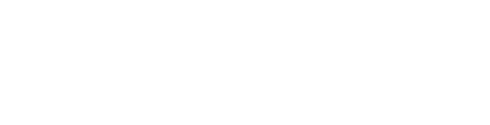

# Slides Gov Hub: código exato validado

Toda apresentação Gov Hub é um **HTML com uma `section.gh-slide` por
slide**, cada uma com **um dos seis templates** do
[catálogo de elementos gráficos](graphic-elements-catalog.md) como fundo,
exportado para PDF. Sem gradiente, sem fundo sólido inventado, sem
`elementos-graficos.svg` / `outros-elementos-graficos.svg` como fundo.

## Arquitetura

Canvas fixo `1920×1080px`, `@page` do mesmo tamanho e margem zero (mesma
ideia da `.gh-page` de `print-pages.md`: cada slide é uma caixa de tamanho
fixo que a impressão respeita). O template entra como `background` via URL
do CDN.

```css
@import url('https://fonts.googleapis.com/css2?family=Oswald:wght@500;600;700&family=Reddit+Sans:wght@400;500;600;700;800&display=swap');

:root {
  --primary-purple: #613EFF;
  --dark-navy:      #0A005A;
  --accent-magenta: #EF41FF;
  --accent-pink:    #F9006F;
  --bg-peach:       #FFE7E1;
  --text-body:      #2D3748;
  --font-family-base:    'Reddit Sans', 'Open Sans', sans-serif;
  --font-family-heading: 'Oswald', 'Reddit Sans', sans-serif;
}

@page { size: 1920px 1080px; margin: 0; }
html, body { margin: 0; padding: 0; }
body { font-family: var(--font-family-base); color: var(--text-body); }

.gh-slide {
  position: relative; width: 1920px; height: 1080px; overflow: hidden;
  page-break-after: always; break-after: page;
  background-position: center; background-size: cover; background-repeat: no-repeat;
}
.gh-slide:last-child { page-break-after: auto; break-after: auto; }

/* um template por tipo de slide (URLs literais: WeasyPrint/Chrome não resolvem var() dentro de url()) */
.gh-slide--cover       { background-image: url("https://cdn.jsdelivr.net/gh/GovHub-br/skills-assets@main/graphic-elements/capa.svg"); color: #fff; }
.gh-slide--section     { background-image: url("https://cdn.jsdelivr.net/gh/GovHub-br/skills-assets@main/graphic-elements/capa-capitulo.svg"); color: #fff; }
.gh-slide--section-alt { background-image: url("https://cdn.jsdelivr.net/gh/GovHub-br/skills-assets@main/graphic-elements/capa-capitulo-alternativa.svg"); color: #fff; }
.gh-slide--content     { background-image: url("https://cdn.jsdelivr.net/gh/GovHub-br/skills-assets@main/graphic-elements/pagina-comum.svg"); }
.gh-slide--emphasis    { background-image: url("https://cdn.jsdelivr.net/gh/GovHub-br/skills-assets@main/graphic-elements/pagina-comum-com-enfase.svg"); }
.gh-slide--closing     { background-image: url("https://cdn.jsdelivr.net/gh/GovHub-br/skills-assets@main/graphic-elements/encerramento.svg"); color: #fff; }

/* ---- capa e encerramento ---- */
.gh-slide--cover .gh-slide__block,
.gh-slide--closing .gh-slide__block {
  position: absolute; top: 50%; transform: translateY(-45%);
}
.gh-slide--cover   .gh-slide__block { left: 120px; width: 1000px; }
.gh-slide--closing .gh-slide__block { left: 900px; right: 120px; }
.gh-slide__logo-big { display: block; height: 72px; width: auto; margin-bottom: 56px; }
.gh-slide__h1 {
  font-family: var(--font-family-heading); font-weight: 700; text-transform: uppercase;
  font-size: 96px; line-height: 1.05; margin: 0 0 28px; color: #fff;
}
.gh-slide__lead { font-size: 36px; line-height: 1.4; margin: 0; opacity: .92; max-width: 30ch; }
.gh-slide__partners { position: absolute; right: 120px; bottom: 64px; display: flex; gap: 40px; align-items: center; }
.gh-slide__partners img { height: 56px; width: auto; }

/* ---- abertura de seção ---- */
.gh-slide--section .gh-slide__block,
.gh-slide--section-alt .gh-slide__block {
  position: absolute; left: 160px; right: 260px; top: 380px; bottom: 160px;
}
.gh-slide__num {
  font-family: var(--font-family-heading); font-weight: 700;
  font-size: 200px; line-height: 1; color: #fff; opacity: .75; margin: 0 0 8px;
}
.gh-slide__eyebrow {
  font-size: 28px; font-weight: 600; letter-spacing: .12em; text-transform: uppercase;
  margin: 0 0 24px; opacity: .85;
}
.gh-slide--section .gh-slide__h1,
.gh-slide--section-alt .gh-slide__h1 { font-size: 88px; max-width: 18ch; }

/* ---- conteúdo e ênfase ---- */
.gh-slide__title {
  position: absolute; left: 60px; top: 74px; height: 73px;
  font-family: var(--font-family-heading); font-weight: 600; text-transform: uppercase;
  font-size: 34px; line-height: 73px; color: var(--dark-navy);
  white-space: nowrap; overflow: hidden; text-overflow: ellipsis;
}
.gh-slide--content  .gh-slide__title { max-width: 600px; }
.gh-slide--emphasis .gh-slide__title { max-width: 820px; }
.gh-slide__body {
  position: absolute; top: 220px; left: 120px; right: 120px; bottom: 100px;
  font-size: 36px; line-height: 1.45; color: var(--text-body);
}
.gh-slide--emphasis .gh-slide__body { right: 760px; bottom: 300px; }
.gh-slide__body h2 { font-family: var(--font-family-heading); text-transform: uppercase; font-size: 52px; color: var(--primary-purple); margin: 0 0 24px; }
.gh-slide__body ul { margin: 0; padding-left: 1.1em; }
.gh-slide__body li { margin-bottom: .5em; }
.gh-slide__body table { border-collapse: collapse; width: 100%; font-size: 30px; background: #fff; }
.gh-slide__body th { background: var(--primary-purple); color: #fff; text-align: left; padding: 14px 20px; }
.gh-slide__body td { padding: 12px 20px; border-bottom: 1px solid rgba(10,0,90,.12); }
.gh-slide__kpi {
  font-family: var(--font-family-heading); font-weight: 700;
  font-size: 150px; line-height: 1; color: var(--accent-pink); margin: 0 0 16px;
}
.gh-slide__quote { font-size: 44px; line-height: 1.35; font-weight: 500; color: var(--dark-navy); margin: 0; max-width: 24ch; }
.gh-slide__logo-small { position: absolute; right: 120px; bottom: 48px; height: 40px; width: auto; }
```

## Ordem canônica de um deck

1. `--cover` (1 slide).
2. Para cada seção: `--section` na 1ª, `--section-alt` na 2ª, `--section` na 3ª... (alternando), seguido de `--content` × N e, se a seção tiver um destaque, **um** `--emphasis`.
3. `--closing` (1 slide).

Um deck sem seções (curto) é `--cover` → `--content` × N → `--closing`.

## HTML de cada tipo (copie e troque só o texto)

Os `src="logo/..."` dos exemplos abaixo pressupõem a pasta `references/logo/`
desta skill copiada para dentro da pasta do deck, como `logo/` irmã do
arquivo HTML (mesma convenção de `print-pages.md`, seção "Caminho dos
assets (logo e ícones)"). Nomes dos arquivos em `editorial-report.md`
seção 1.

Capa. Logomarca branca (`logomarca-horizontal-white.svg`) acima do título,
como na capa PDF:

```html
<section class="gh-slide gh-slide--cover">
  <div class="gh-slide__block">
    
    <h1 class="gh-slide__h1">Título da apresentação</h1>
    <p class="gh-slide__lead">Subtítulo ou contexto em uma ou duas linhas. Evento, data, equipe.</p>
  </div>
</section>
```

Abertura de seção (numeral + eyebrow + título, o mesmo padrão de
`print-header.md`):

```html
<section class="gh-slide gh-slide--section">
  <div class="gh-slide__block">
    <p class="gh-slide__num">01</p>
    <p class="gh-slide__eyebrow">Seção</p>
    <h1 class="gh-slide__h1">Título da primeira seção</h1>
  </div>
</section>
```

Abertura de seção alternativa (a próxima seção):

```html
<section class="gh-slide gh-slide--section-alt">
  <div class="gh-slide__block">
    <p class="gh-slide__num">02</p>
    <p class="gh-slide__eyebrow">Seção</p>
    <h1 class="gh-slide__h1">Título da segunda seção</h1>
  </div>
</section>
```

Conteúdo padrão. O título vai **dentro da pílula** (cabe ~28 caracteres em
Oswald 34px; se passar disso, encurte o título, não diminua a fonte):

```html
<section class="gh-slide gh-slide--content">
  <div class="gh-slide__title">Título curto na pílula</div>
  <div class="gh-slide__body">
    <h2>Subtítulo opcional</h2>
    <ul>
      <li>Primeiro ponto do slide, uma frase objetiva.</li>
      <li>Segundo ponto, com o mesmo tamanho de frase.</li>
      <li>Terceiro ponto. No máximo cinco por slide.</li>
    </ul>
  </div>
  
</section>
```

Conteúdo com tabela (mesmo template; tabela com fundo branco sobre o pêssego):

```html
<section class="gh-slide gh-slide--content">
  <div class="gh-slide__title">Resultados por etapa</div>
  <div class="gh-slide__body">
    <table>
      <thead><tr><th>Etapa</th><th>Entregas</th><th>Status</th></tr></thead>
      <tbody>
        <tr><td>Diagnóstico</td><td>3</td><td>Concluído</td></tr>
        <tr><td>Pipeline</td><td>5</td><td>Em andamento</td></tr>
        <tr><td>Painel</td><td>2</td><td>Planejado</td></tr>
      </tbody>
    </table>
  </div>
  
</section>
```

Ênfase (número-chave ou citação; corpo limitado aos ~60 % da esquerda):

```html
<section class="gh-slide gh-slide--emphasis">
  <div class="gh-slide__title">Título curto na pílula</div>
  <div class="gh-slide__body">
    <p class="gh-slide__kpi">87%</p>
    <p class="gh-slide__quote">das bases integradas passaram a ter documentação de colunas.</p>
  </div>
</section>
```

Encerramento (texto na metade direita; logos dos parceiros na ordem fixa
Lab Livre → UnB, de `references/logo/parceiros/`; Ipea e ministério do
projeto entram depois, se houver, na versão `negativo` — ver
[`partners.md`](partners.md)):

```html
<section class="gh-slide gh-slide--closing">
  <div class="gh-slide__block">
    <h1 class="gh-slide__h1">Obrigado</h1>
    <p class="gh-slide__lead">gov-hub.io<br>contato@gov-hub.io</p>
  </div>
  <div class="gh-slide__partners">
    
    
  </div>
</section>
```

## Zonas seguras (px no canvas 1920×1080)

Derivadas da geometria dos SVGs. Texto **fora** delas colide com as formas.

| Template | Zona de texto | Ocupada pelas formas |
|---|---|---|
| `capa` | `x 120–1120`, altura toda | `x > 1280` (quarto de círculo roxo), topo `x 1107–1608, y < 274` (meio-anel), rodapé `x > 1167, y > 782` (pílula) |
| `capa-capitulo` / `alternativa` | `x 160–1660, y 380–920`, texto alinhado à esquerda (encolhida pra não invadir o canto) | canto superior esquerdo `x < 749, y < 283`; topo `x 510–995, y < 186`; canto inferior direito `x > 1670, y > 860` |
| `pagina-comum` | título `x 60–660, y 74–147`; corpo `x 120–1800, y 220–980` | só a pílula do título |
| `pagina-comum-com-enfase` | título `x 60–880, y 74–147`; corpo `x 120–1160, y 220–780` | canto superior direito `x > 1700, y < 250`; rodapé direito `x > 925, y > 798` |
| `encerramento` | `x 900–1800`, altura toda | `x < 640` (quarto de círculo roxo), topo `x < 753, y < 298` (pílula), rodapé `x 312–813, y > 806` (meio-anel) |

## Tipografia e cor nos slides

- Títulos e numerais: **Oswald**, uppercase. Corpo: **Reddit Sans**.
- Sobre pêssego (`--content`, `--emphasis`): texto navy/`--text-body`, subtítulos roxo. Sobre navy e roxo (`--cover`, `--section*`, `--closing`): texto branco.
- Rosa `#F9006F` só no número-chave do slide de ênfase (um por slide).
- Tabelas e cards com fundo **branco** sobre o pêssego (o pêssego não é fundo de tabela).
- Logo: grande só na capa (branca); pequena no canto inferior direito dos slides de conteúdo (navy sobre pêssego). Sem logo nas aberturas de seção e no slide de ênfase (as formas já ocupam o canto).

## Exportar para PDF

WeasyPrint (funciona sem navegador; renderiza SVG de fundo e fontes do Google):

```bash
pip install --user weasyprint pypdfium2
python3 -m weasyprint deck.html deck.pdf
```

Chrome headless, se disponível:

```bash
chrome --headless=new --disable-gpu --no-pdf-header-footer --print-to-pdf="deck.pdf" "file:///caminho/para/deck.html"
```

## Conferência visual obrigatória

Como em `print-pages.md`: rasterize **todas** as páginas e olhe cada uma.
Erros que só aparecem olhando: título maior que a pílula (cortado com
reticências), corpo invadindo as formas do slide de ênfase, slide que virou
duas páginas por overflow.

```python
import pypdfium2 as pdfium
pdf = pdfium.PdfDocument("deck.pdf")
for i, page in enumerate(pdf):
    page.render(scale=0.5).to_pil().save(f"slide-{i+1}.png")
```

Checklist por slide: (1) número de páginas do PDF = número de `.gh-slide`;
(2) texto inteiro dentro da zona segura do template; (3) template certo para
o papel do slide (capa/seção/conteúdo/ênfase/encerramento); (4) seções
consecutivas alternando `--section` / `--section-alt`.

## Erros a evitar

- Fundo sólido ou gradiente no lugar de um template (instrução antiga desta skill, revogada).
- Usar `elementos-graficos.svg` ou `outros-elementos-graficos.svg` como fundo de slide.
- Título de conteúdo maior que a pílula (reduzir o texto, não a fonte).
- Dois slides de ênfase seguidos, ou ênfase sem número/citação (vira slide comum).
- Texto do slide de ênfase passando de `x 1160` ou `y 780`.
- `var()` dentro de `url()`: os motores de PDF não resolvem; use a URL literal.
