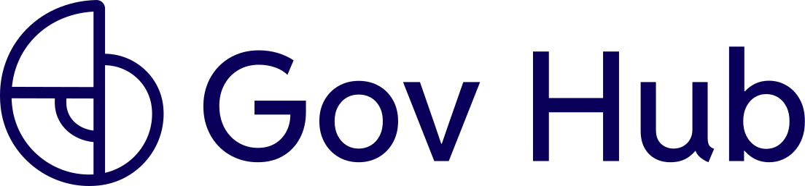
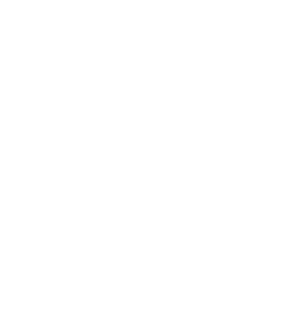
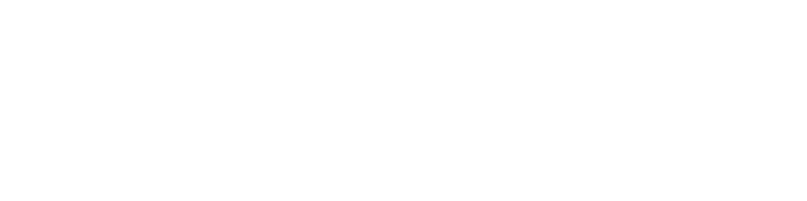
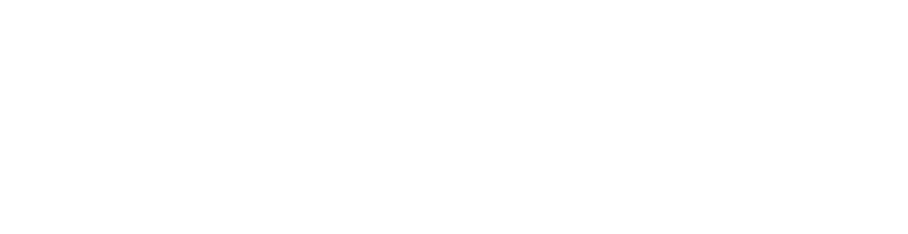

# Posts e carrossel Gov Hub: as 5 estruturas de quadro (código exato validado)

Estruturas de quadro para Instagram/LinkedIn (feed retrato `1080×1350`),
validadas com o usuário no carrossel "Dados públicos, conectados"
(2026-09-16). Cada quadro é **um `div.gh-post` de tamanho fixo** com uma
das cinco estruturas abaixo. Não invente uma sexta: se o conteúdo não
cabe em nenhuma, encurte o conteúdo.

As regras gerais de composição (fundo sólido, 2 a 4 formas sangrando,
proporções, paleta) estão na seção "Comunicação" de
[`graphic-elements-catalog.md`](graphic-elements-catalog.md); este arquivo
é a aplicação concreta delas.

## Quando usar cada estrutura

| # | Estrutura | Fundo | Papel no carrossel |
|---|---|---|---|
| 1 | **Capa** | navy | 1º quadro. Logo + chamada + apoio. |
| 2 | **Conteúdo** | pêssego | Quadros de explicação: rótulo na pílula, título, descrição e um bloco (cards em grade, lista de cards ou fluxo de 3 passos). |
| 3 | **Ênfase** | roxo | Pergunta-gancho, número-chave ou citação. No máximo 1 por carrossel. |
| 4 | **Convite** | pêssego | Penúltimo quadro: chamada + botão rosa (único uso do rosa em área). |
| 5 | **Fechamento** | navy | Último quadro. Logo grande, site, assinatura institucional. |

Ordem canônica de um carrossel: `capa → conteúdo × N → ênfase → conteúdo × N
→ convite → fechamento`. Um post único usa só a **capa** (ou só a **ênfase**).

Os fundos da tabela são os padrão. Cada estrutura também existe nos outros
4 fundos da paleta e em 3 composições alternativas de formas, como
**arquivos HTML prontos no CDN**: ver "Variações: fundos e composições"
no fim deste arquivo antes de recompor qualquer coisa à mão.

## Base compartilhada

Tokens, fontes e os helpers que todas as estruturas usam. Texto corrido é
justificado **só pelo espaçamento entre palavras**: `hyphens: none` e
`overflow-wrap: normal`, nenhuma palavra quebra em duas linhas (pedido do
usuário). Se uma palavra longa estourar a caixa, encurte o texto.

```css
@import url('https://fonts.googleapis.com/css2?family=Oswald:wght@500;600;700&family=Reddit+Sans:wght@400;500;600;700;800&display=swap');

:root {
  --primary-purple: #613EFF;
  --dark-navy:      #0A005A;
  --accent-magenta: #EF41FF;
  --accent-pink:    #F9006F;
  --bg-peach:       #FFE7E1;
  --text-body:      #2D3748;
  --text-muted:     #666666;
  --font-family-base:    'Reddit Sans', 'Open Sans', -apple-system, 'Segoe UI', Roboto, Arial, sans-serif;
  --font-family-heading: 'Oswald', 'Arial Narrow', 'Reddit Sans', sans-serif;
}

body { margin: 0; font-family: var(--font-family-base); -webkit-font-smoothing: antialiased; }

/* quadro: 1080×1350, margem lateral 88px */
.gh-post { position: relative; width: 1080px; height: 1350px; overflow: hidden; }
.gh-post--navy   { background: var(--dark-navy);      color: #fff; }
.gh-post--purple { background: var(--primary-purple); color: #fff; }
.gh-post--peach  { background: var(--bg-peach);       color: var(--dark-navy); }

/* formas: snippets do graphic-elements-catalog, posicionadas por inline style */
.gh-shape { position: absolute; display: block; }

/* chamada (Oswald uppercase) e apoio (Reddit Sans, justificado) */
.gh-post__h1 {
  margin: 0; font-family: var(--font-family-heading); font-weight: 700; text-transform: uppercase;
  line-height: 1.04; letter-spacing: 0.005em;
}
.gh-post__p { margin: 0; font-size: 34px; line-height: 1.45; text-align: justify; hyphens: none; overflow-wrap: normal; }
.gh-post--navy .gh-post__p, .gh-post--purple .gh-post__p { color: rgba(255,255,255,0.9); }
.gh-post--peach .gh-post__p { color: var(--text-body); font-size: 33px; }

/* contador "02/07" no canto superior direito */
.gh-post__counter {
  position: absolute; right: 88px; top: 104px;
  font-size: 24px; font-weight: 600; font-variant-numeric: tabular-nums;
}
.gh-post--navy .gh-post__counter, .gh-post--purple .gh-post__counter { color: rgba(255,255,255,0.85); }

/* rótulo da seção dentro de uma pílula magenta sangrando pela esquerda (texto navy: branco sobre magenta é proibido) */
.gh-post__label {
  position: absolute; left: 0; top: 80px; height: 96px; padding: 0 44px 0 88px;
  border-radius: 0 48px 48px 0; background: var(--accent-magenta);
  display: flex; align-items: center;
  font-family: var(--font-family-heading); font-weight: 600; text-transform: uppercase;
  letter-spacing: 0.1em; font-size: 30px; color: var(--dark-navy);
}

/* barra inferior: só a logomarca à esquerda (sem "gov-hub.io" ao lado), "Arraste para o lado" à direita */
.gh-post__bottom {
  position: absolute; left: 88px; right: 88px; bottom: 72px; height: 44px;
  display: flex; align-items: center; justify-content: space-between;
  font-size: 24px;
}
.gh-post__bottom > div { display: flex; align-items: center; gap: 12px; }
.gh-post__bottom img { height: 44px; width: auto; }
.gh-post__hint  { font-weight: 500; }
.gh-post--navy .gh-post__bottom, .gh-post--purple .gh-post__bottom { color: rgba(255,255,255,0.85); }

/* chip de ícone de produto: a cor do chip É o fundo pra que a variante foi desenhada */
.gh-chip { border-radius: 20px; display: flex; align-items: center; justify-content: center; flex-shrink: 0; }
.gh-chip--pink  { background: var(--accent-pink); } /* variante -orange: dentro de card branco */
.gh-chip--peach { background: var(--bg-peach); }    /* variante -default: só direto sobre o fundo pêssego */
.gh-chip--navy  { background: var(--dark-navy); }   /* variante -purple: sobre o roxo */
.gh-chip--md { width: 96px;  height: 96px;  } .gh-chip--md img { width: 66px;  height: 66px;  }
.gh-chip--lg { width: 104px; height: 104px; } .gh-chip--lg img { width: 74px;  height: 74px;  }
.gh-chip--xl { width: 128px; height: 128px; } .gh-chip--xl img { width: 90px;  height: 90px;  }

/* card "ícone + título forte + descrição discreta" (sobre pêssego: branco sólido) */
.gh-card { border-radius: 24px; background: #fff; }
.gh-card__title { font-size: 31px; font-weight: 700; color: var(--dark-navy); line-height: 1.2; }
.gh-card__desc  { font-size: 25px; line-height: 1.35; color: var(--text-body); text-align: justify; hyphens: none; overflow-wrap: normal; }
```

Seta usada na barra inferior, no fluxo e no botão (troque só `stroke` e o
tamanho):

```html
<svg class="gh-arrow" width="28" height="28" viewBox="0 0 24 24" fill="none" stroke="currentColor" stroke-width="2.2" stroke-linecap="round" stroke-linejoin="round"><path d="M5 12h14"></path><path d="M13 6l6 6-6 6"></path></svg>
```

### Ícones de produto nos posts

O repositório `GovHub-br/skills-assets` foi regerado na paleta atual
(2026-09-16). Cada variante já traz o **fundo embutido**, então o chip em
volta precisa ter exatamente essa cor:

| Variante | Fundo embutido | Onde entra no post |
|---|---|---|
| `-orange.svg` | rosa `#F9006F` (contorno navy, sombra pêssego) | `.gh-chip--pink` **dentro de card branco** (estruturas 2 e 4). O chip pêssego sobre card branco ficou fraco; o rosa é o que chama atenção. |
| `-default.svg` | pêssego `#FFE7E1` (contorno navy, sombra rosa) | `.gh-chip--peach` **direto sobre o fundo pêssego**, fora de card (chip grande do convite). |
| `-purple.svg` | navy `#0A005A` (contorno pêssego, sombra rosa) | `.gh-chip--navy` sobre o roxo da estrutura 3. |

Nunca o ícone solto sobre pêssego, roxo, navy ou branco sem o chip da cor
certa, e nunca chip pêssego dentro de card branco. Em ambiente sem internet, baixe os SVGs (ver `icons-catalog.md`) e
troque o `src` por caminho relativo.

## 1. Capa (navy)

Quarto de círculo roxo no canto superior direito (50 % do lado menor),
meio-anel magenta sangrando pela base à esquerda, semi-pílula pêssego
sangrando pela direita. Zona livre: toda a metade inferior esquerda.
Chamada em Oswald 112px cabe em 2 linhas com até ~30 caracteres.

```html
<div class="gh-post gh-post--navy" lang="pt-BR">
  <svg class="gh-shape" viewBox="0 0 100 100" aria-hidden="true" style="right:-1px; top:-1px; width:540px; height:540px; color:var(--primary-purple); transform:rotate(90deg)"><path fill="currentColor" d="M0 0h100a100 100 0 0 1-100 100z"></path></svg>
  <svg class="gh-shape" viewBox="0 0 100 50" aria-hidden="true" style="left:60px; bottom:-1px; width:324px; height:162px; color:var(--accent-magenta); transform:rotate(180deg)"><path fill="currentColor" fill-rule="evenodd" d="M0 0h100a50 50 0 0 1-100 0zM25.6 0h48.8a24.4 24.4 0 0 1-48.8 0z"></path></svg>
  <svg class="gh-shape" viewBox="0 0 197 100" aria-hidden="true" style="right:-1px; bottom:300px; width:238px; height:121px; color:var(--bg-peach)"><path fill="currentColor" d="M197 0H50a50 50 0 0 0 0 100h147z"></path></svg>

  

  <div style="position:absolute; left:88px; right:88px; top:600px; display:flex; flex-direction:column; gap:36px;">
    <h1 class="gh-post__h1" style="font-size:112px; color:#fff;">Chamada da capa em duas linhas.</h1>
    <p class="gh-post__p" style="font-size:36px; max-width:700px;">Texto de apoio em duas ou três linhas, dizendo do que se trata a peça.</p>
  </div>

  <div class="gh-post__bottom">
    <div></div>
    <div><span class="gh-post__hint">Arraste para o lado</span><svg class="gh-arrow" width="28" height="28" viewBox="0 0 24 24" fill="none" stroke="currentColor" stroke-width="2.2" stroke-linecap="round" stroke-linejoin="round"><path d="M5 12h14"></path><path d="M13 6l6 6-6 6"></path></svg></div>
  </div>
</div>
```

## 2. Conteúdo (pêssego)

Pílula magenta com o rótulo da seção no topo à esquerda, contador à
direita, quarto de círculo roxo no canto superior direito (470px) e um anel
pequeno (rosa ou magenta) sangrando pelo canto inferior esquerdo. O título
fica **à esquerda do quarto de círculo** (largura máxima 500px, altura
mínima reservada 270px, alinhado à base); descrição e bloco ocupam a
largura toda a partir de ~y 500. Barra inferior com a logomarca navy
(`logomarca-horizontal-navy.svg`, 44px) + "Arraste".

Esqueleto (o `<!-- BLOCO -->` recebe uma das três variantes abaixo):

```html
<div class="gh-post gh-post--peach" lang="pt-BR">
  <svg class="gh-shape" viewBox="0 0 100 100" aria-hidden="true" style="right:-1px; top:-1px; width:470px; height:470px; color:var(--primary-purple); transform:rotate(90deg)"><path fill="currentColor" d="M0 0h100a100 100 0 0 1-100 100z"></path></svg>
  <svg class="gh-shape" viewBox="0 0 100 100" aria-hidden="true" style="left:-100px; bottom:-100px; width:200px; height:200px; color:var(--accent-pink)"><path fill="currentColor" fill-rule="evenodd" d="M50 0a50 50 0 1 0 0 100a50 50 0 1 0 0-100zM50 25.6a24.4 24.4 0 1 1 0 48.8a24.4 24.4 0 1 1 0-48.8z"></path></svg>

  <div class="gh-post__label">Rótulo da seção</div>
  <div class="gh-post__counter">02/07</div>

  <div style="position:absolute; left:88px; right:88px; top:236px; display:flex; flex-direction:column; gap:28px;">
    <div style="min-height:270px; max-width:500px; display:flex; align-items:flex-end;">
      <h1 class="gh-post__h1" style="font-size:66px; color:var(--dark-navy);">Título forte em até três linhas.</h1>
    </div>
    <p class="gh-post__p">Descrição discreta e justificada, de três a quatro linhas, com o texto original do briefing.</p>
    <!-- BLOCO -->
  </div>

  <div class="gh-post__bottom">
    <div></div>
    <div><span class="gh-post__hint">Arraste para o lado</span><svg class="gh-arrow" width="28" height="28" viewBox="0 0 24 24" fill="none" stroke="currentColor" stroke-width="2.2" stroke-linecap="round" stroke-linejoin="round"><path d="M5 12h14"></path><path d="M13 6l6 6-6 6"></path></svg></div>
  </div>
</div>
```

Limites de encaixe (para a barra inferior não ser invadida): título até 3
linhas, descrição até 4 linhas e **um** dos blocos abaixo. Se passar,
corte texto, não reduza fonte.

**Bloco A: grade de 2 cards** (quem faz, dois conceitos lado a lado):

```html
<div style="display:grid; grid-template-columns:repeat(2, minmax(0, 1fr)); gap:24px; margin-top:8px;">
  <div class="gh-card" style="display:flex; flex-direction:column; gap:18px; padding:28px;">
    <div class="gh-chip gh-chip--pink gh-chip--md"></div>
    <div class="gh-card__title">Título do card</div>
    <div class="gh-card__desc">Descrição em até três linhas.</div>
  </div>
  <div class="gh-card" style="display:flex; flex-direction:column; gap:18px; padding:28px;">
    <div class="gh-chip gh-chip--pink gh-chip--md"></div>
    <div class="gh-card__title">Título do card</div>
    <div class="gh-card__desc">Descrição em até três linhas.</div>
  </div>
</div>
```

**Bloco B: lista de 3 cards** (o que entregamos, benefícios):

```html
<div style="display:flex; flex-direction:column; gap:18px; margin-top:8px;">
  <div class="gh-card" style="display:flex; align-items:center; gap:28px; padding:24px 28px;">
    <div class="gh-chip gh-chip--pink gh-chip--md"></div>
    <div style="display:flex; flex-direction:column; gap:6px; flex:1;">
      <div class="gh-card__title">Título do item</div>
      <div class="gh-card__desc">Descrição em até duas linhas.</div>
    </div>
  </div>
  <!-- repita o card acima até 3 vezes -->
</div>
```

**Bloco C: fluxo de 3 passos** (como funciona; o passo do meio é a
plataforma, em roxo, com o símbolo branco da logo):

```html
<div style="display:flex; align-items:stretch; gap:20px; margin-top:8px;">
  <div class="gh-card" style="display:flex; flex-direction:column; align-items:center; justify-content:center; gap:18px; padding:32px 20px; flex:1; min-height:250px; box-sizing:border-box;">
    <div class="gh-chip gh-chip--pink gh-chip--lg"></div>
    <div class="gh-card__title" style="font-size:27px; text-align:center; line-height:1.25;">Bases<br>de dados</div>
  </div>
  <div style="display:flex; align-items:center; color:var(--primary-purple);"><svg class="gh-arrow" width="44" height="44" viewBox="0 0 24 24" fill="none" stroke="currentColor" stroke-width="2.2" stroke-linecap="round" stroke-linejoin="round"><path d="M5 12h14"></path><path d="M13 6l6 6-6 6"></path></svg></div>
  <div class="gh-card" style="display:flex; flex-direction:column; align-items:center; justify-content:center; gap:18px; padding:32px 20px; flex:1; min-height:250px; box-sizing:border-box; background:var(--primary-purple);">
    
    <div class="gh-card__title" style="font-size:27px; text-align:center; line-height:1.25; color:#fff;">Plataforma<br>Gov Hub</div>
  </div>
  <div style="display:flex; align-items:center; color:var(--primary-purple);"><svg class="gh-arrow" width="44" height="44" viewBox="0 0 24 24" fill="none" stroke="currentColor" stroke-width="2.2" stroke-linecap="round" stroke-linejoin="round"><path d="M5 12h14"></path><path d="M13 6l6 6-6 6"></path></svg></div>
  <div class="gh-card" style="display:flex; flex-direction:column; align-items:center; justify-content:center; gap:18px; padding:32px 20px; flex:1; min-height:250px; box-sizing:border-box;">
    <div class="gh-chip gh-chip--pink gh-chip--lg"></div>
    <div class="gh-card__title" style="font-size:27px; text-align:center; line-height:1.25;">Dados<br>integrados</div>
  </div>
</div>
<div style="display:flex; gap:14px; flex-wrap:wrap;">
  <span style="font-size:24px; font-weight:600; color:#fff; background:var(--primary-purple); padding:10px 22px; border-radius:999px;">Atributo um</span>
  <span style="font-size:24px; font-weight:600; color:#fff; background:var(--primary-purple); padding:10px 22px; border-radius:999px;">Atributo dois</span>
</div>
```

## 3. Ênfase (roxo)

Quarto de círculo navy no canto inferior esquerdo (518px), semicírculo
pêssego sangrando pelo topo (centro-esquerda) e anel magenta sangrando pela
direita. Chip navy com ícone `-purple`, pergunta em Oswald 62px (até 4
linhas, largura 860px) e apoio curto (620px). Zona livre: de y 220 a y 830.
Sem marca na barra inferior (só o "Arraste"); a marca fica no contador e
nos quadros vizinhos.

```html
<div class="gh-post gh-post--purple" lang="pt-BR">
  <svg class="gh-shape" viewBox="0 0 100 100" aria-hidden="true" style="left:-1px; bottom:-1px; width:518px; height:518px; color:var(--dark-navy); transform:rotate(270deg)"><path fill="currentColor" d="M0 0h100a100 100 0 0 1-100 100z"></path></svg>
  <svg class="gh-shape" viewBox="0 0 100 50" aria-hidden="true" style="left:380px; top:-1px; width:280px; height:140px; color:var(--bg-peach)"><path fill="currentColor" d="M0 0h100a50 50 0 0 1-100 0z"></path></svg>
  <svg class="gh-shape" viewBox="0 0 100 100" aria-hidden="true" style="right:-70px; top:560px; width:180px; height:180px; color:var(--accent-magenta)"><path fill="currentColor" fill-rule="evenodd" d="M50 0a50 50 0 1 0 0 100a50 50 0 1 0 0-100zM50 25.6a24.4 24.4 0 1 1 0 48.8a24.4 24.4 0 1 1 0-48.8z"></path></svg>

  <div class="gh-post__counter">04/07</div>

  <div style="position:absolute; left:88px; right:88px; top:220px; display:flex; flex-direction:column; gap:40px;">
    <div class="gh-chip gh-chip--navy" style="width:160px; height:160px; border-radius:28px;"></div>
    <h1 class="gh-post__h1" style="font-size:62px; color:#fff; max-width:860px;">Pergunta-gancho ou frase de impacto em até quatro linhas?</h1>
    <p class="gh-post__p" style="max-width:620px;">Apoio de uma ou duas linhas que reforça a dor.</p>
  </div>

  <div class="gh-post__bottom">
    <div></div>
    <div><span class="gh-post__hint">Arraste para o lado</span><svg class="gh-arrow" width="28" height="28" viewBox="0 0 24 24" fill="none" stroke="currentColor" stroke-width="2.2" stroke-linecap="round" stroke-linejoin="round"><path d="M5 12h14"></path><path d="M13 6l6 6-6 6"></path></svg></div>
  </div>
</div>
```

Variante número-chave: troque o chip + pergunta por um numeral em Oswald
150px rosa (`--accent-pink`) seguido da frase em 62px branca.

## 4. Convite (pêssego, CTA rosa)

Mesma linguagem da estrutura 2, mas com o quarto de círculo roxo no canto
**inferior direito** (o conteúdo desce e o canto superior fica livre para
a chamada longa) e anel magenta no canto inferior esquerdo. Chip pêssego
grande com ícone, chamada em 66px (largura total, até 3 linhas), apoio
curto (560px), botão pílula rosa e a linha de contato (site + e-mail
oficial `caguiar@unb.br`). Barra inferior só com "Arraste". Aqui o chip
fica direto sobre o pêssego, por isso é pêssego + `-default`.

```html
<div class="gh-post gh-post--peach" lang="pt-BR">
  <svg class="gh-shape" viewBox="0 0 100 100" aria-hidden="true" style="right:-1px; bottom:-1px; width:470px; height:470px; color:var(--primary-purple); transform:rotate(180deg)"><path fill="currentColor" d="M0 0h100a100 100 0 0 1-100 100z"></path></svg>
  <svg class="gh-shape" viewBox="0 0 100 100" aria-hidden="true" style="left:-100px; bottom:-100px; width:200px; height:200px; color:var(--accent-magenta)"><path fill="currentColor" fill-rule="evenodd" d="M50 0a50 50 0 1 0 0 100a50 50 0 1 0 0-100zM50 25.6a24.4 24.4 0 1 1 0 48.8a24.4 24.4 0 1 1 0-48.8z"></path></svg>

  <div class="gh-post__label">Vamos conversar</div>
  <div class="gh-post__counter">06/07</div>

  <div style="position:absolute; left:88px; right:88px; top:236px; display:flex; flex-direction:column; gap:32px;">
    <div class="gh-chip gh-chip--peach gh-chip--xl"></div>
    <h1 class="gh-post__h1" style="font-size:66px; color:var(--dark-navy); max-width:900px;">Chamada do convite em até três linhas?</h1>
    <p class="gh-post__p" style="max-width:560px;">Apoio de duas linhas convidando ao contato.</p>
    <div style="display:flex; flex-direction:column; gap:22px; margin-top:8px;">
      <div style="display:inline-flex; align-items:center; gap:16px; align-self:flex-start; padding:24px 40px; border-radius:999px; background:var(--accent-pink); color:#fff; font-size:30px; font-weight:700;">Fale com a gente <svg class="gh-arrow" width="30" height="30" viewBox="0 0 24 24" fill="none" stroke="currentColor" stroke-width="2.2" stroke-linecap="round" stroke-linejoin="round"><path d="M5 12h14"></path><path d="M13 6l6 6-6 6"></path></svg></div>
      <div style="display:flex; flex-direction:column; gap:6px;">
        <span style="font-size:30px; font-weight:700; color:var(--dark-navy);">gov-hub.io</span>
        <span style="font-size:26px; font-weight:500; color:var(--text-muted);">caguiar@unb.br</span>
      </div>
    </div>
  </div>

  <div class="gh-post__bottom">
    <div></div>
    <div><span class="gh-post__hint" style="color:var(--dark-navy);">Arraste para o lado</span><svg class="gh-arrow" width="28" height="28" viewBox="0 0 24 24" fill="none" stroke="var(--dark-navy)" stroke-width="2.2" stroke-linecap="round" stroke-linejoin="round"><path d="M5 12h14"></path><path d="M13 6l6 6-6 6"></path></svg></div>
  </div>
</div>
```

## 5. Fechamento (navy)

Espelho da capa: quarto de círculo roxo no canto superior **esquerdo**,
meio-anel magenta sangrando pela base à direita, semi-pílula pêssego
sangrando pela esquerda. Conteúdo centralizado abaixo do quarto de círculo
(logo grande, site, tagline em Oswald) e a assinatura institucional
("Uma iniciativa de" + logos dos parceiros, ordem e versões em
[`partners.md`](partners.md)) em y 1000. Sem "Arraste".

```html
<div class="gh-post gh-post--navy" lang="pt-BR">
  <svg class="gh-shape" viewBox="0 0 100 100" aria-hidden="true" style="left:-1px; top:-1px; width:540px; height:540px; color:var(--primary-purple)"><path fill="currentColor" d="M0 0h100a100 100 0 0 1-100 100z"></path></svg>
  <svg class="gh-shape" viewBox="0 0 100 50" aria-hidden="true" style="right:60px; bottom:-1px; width:324px; height:162px; color:var(--accent-magenta); transform:rotate(180deg)"><path fill="currentColor" fill-rule="evenodd" d="M0 0h100a50 50 0 0 1-100 0zM25.6 0h48.8a24.4 24.4 0 0 1-48.8 0z"></path></svg>
  <svg class="gh-shape" viewBox="0 0 197 100" aria-hidden="true" style="left:-1px; top:620px; width:238px; height:121px; color:var(--bg-peach); transform:scaleX(-1)"><path fill="currentColor" d="M197 0H50a50 50 0 0 0 0 100h147z"></path></svg>

  <div class="gh-post__counter">07/07</div>

  <div style="position:absolute; left:88px; right:88px; top:600px; display:flex; flex-direction:column; align-items:center; gap:28px; text-align:center;">
    
    <div style="font-size:40px; font-weight:700; color:#fff;">gov-hub.io</div>
    <div style="font-family:var(--font-family-heading); font-weight:600; text-transform:uppercase; letter-spacing:0.06em; font-size:34px; color:rgba(255,255,255,0.85);">Tagline da marca.</div>
  </div>

  <div style="position:absolute; left:88px; right:88px; top:1000px; display:flex; flex-direction:column; align-items:center; gap:28px;">
    <div style="font-size:22px; font-weight:600; letter-spacing:0.12em; text-transform:uppercase; color:rgba(255,255,255,0.75);">Uma iniciativa de</div>
    <div style="display:flex; align-items:center; justify-content:center; gap:48px;">
      
      
    </div>
  </div>
</div>
```

## Variações: fundos e composições (100 templates prontos)

Validadas com o usuário em 2026-09-17 numa galeria com as 100 combinações
(5 estruturas × 4 composições × 5 fundos). Todas foram aprovadas. Os
arquivos vivem em `GovHub-br/skills-assets`, pasta `post-templates/`, um
HTML por combinação, com texto de exemplo no lugar do conteúdo:

```
https://cdn.jsdelivr.net/gh/GovHub-br/skills-assets@main/post-templates/<estrutura>-<composição>-<fundo>.html
```

`estrutura` ∈ `capa | conteudo | enfase | convite | fechamento`;
`composição` ∈ `A | B | C | D` (A é a deste arquivo, só com a cor trocada);
`fundo` ∈ `purple | navy | peach | pink | magenta`. A galeria interativa é o
`index.html` da mesma pasta. Para gerar uma peça numa variação: baixe o
arquivo, troque os textos de exemplo e os ícones (chips levam o símbolo
branco do Gov Hub como stand-in; substitua pelo ícone de produto da
variante certa), mantenha formas e posições. Não recomponha do zero.

### Composições por estrutura

| Estrutura | B | C | D |
|---|---|---|---|
| Capa | círculo grande sangrando TL + pílula à direita + quarto de anel BL; logo no topo direito; texto na metade inferior | semicírculo largo no topo + anel à direita + círculo pequeno BL; logo na barra inferior | pílula vertical colada à esquerda + quarto BR + meio-anel no topo; texto no topo à direita (x 260), "Arraste" à esquerda |
| Conteúdo | quarto TL + anel à direita; rótulo pela **direita**, contador na barra, título ao lado do quarto (x 418) | cacho de 3 formas pequenas no canto superior direito; contador na barra; título até 560 px | círculo grande BR **atrás dos cards** + meio-anel no topo; título na largura toda; barra alinhada à esquerda |
| Ênfase | círculo de 800 px centrado atrás do texto (cor segura) + anel TL; **número-chave** (190 px) + frase, centralizados | quartos TL e BR em diagonal; chip 120 px e texto na faixa central (y 470–890); barra à esquerda | meio-anel grande sangrando pela direita + pílula na base esquerda; texto até 700 px |
| Convite | semicírculo largo na base + anel à direita; conteúdo no topo; sem "Arraste" | círculo sangrando TR + pílula BL; contador na barra | quatro formas pequenas nos cantos; sem rótulo e sem contador; conteúdo começa em y 300 |
| Fechamento | espelho da capa B (círculo TR, pílula à esquerda, quarto de anel BR) | anel de 800 px centrado atrás da logo (cor segura) + círculo TR | semicírculo no topo + semi-pílula na base à direita |

Posições exatas: no HTML de cada arquivo (e na spec de `index.html`).

### Regras de cor por fundo

Texto, logo, formas e componentes trocam juntos quando o fundo muda:

| Fundo | Texto | Logo | Formas (principal, secundária, detalhe) | Pílula de rótulo | Chip | Botão CTA | Parceiros |
|---|---|---|---|---|---|---|---|
| navy | branco | white | roxo, magenta, pêssego (rosa só como 4ª, pequena) | magenta / texto navy | roxo | rosa | brancas |
| roxo | branco | white | navy, pêssego, magenta | pêssego / navy | navy | rosa | brancas |
| pêssego | navy | navy | roxo, navy, magenta | magenta / navy | rosa | rosa | `lab-livre-black` + `unb-dark-outlined` |
| rosa | branco (peso ≥ 600) | white | navy, roxo, pêssego | navy / branco | navy | **navy** | brancas |
| magenta | navy | navy | navy, roxo, pêssego | pêssego / navy | navy | **navy** | `lab-livre-black` + `unb-dark-outlined` |

- **Cor segura** (forma grande atrás de texto, ênfase B e fechamento C):
  navy→roxo, roxo→navy, pêssego→magenta, rosa→navy, magenta→pêssego.
- **Numeral da ênfase B** sobre a cor segura: rosa em navy/roxo, navy em
  pêssego/magenta, branco em rosa.
- Pares evitados: rosa sobre magenta e vice-versa; pêssego como forma
  principal sobre rosa. Rosa continua acento: no máximo uma forma pequena
  por quadro, salvo quando é o próprio fundo.
- Fundo rosa em área grande foge da regra "rosa = acento"; está disponível,
  mas prefira navy/roxo/pêssego em capa e conteúdo.

## Padrão de escrita nos posts

- Título forte (Oswald uppercase), descrição discreta (Reddit Sans
  justificada) e um ícone de produto por card: essa tríade é a organização
  aprovada; não troque o ícone por emoji nem por ícone de linha genérico.
- Texto corrido sempre `text-align: justify` com `hyphens: none` e
  `overflow-wrap: normal`: nenhuma palavra quebra em duas linhas, a
  justificação vem só do espaçamento entre palavras. Chamadas e títulos de
  card ficam alinhados à esquerda.
- **Sem travessão** (—) no texto e **sem traço decorativo** (barra fina
  colorida sob o título, linha divisória). Separação é feita por espaço,
  cor de fundo ou forma.
- Sobre navy/roxo, texto branco; sobre pêssego, navy. Nunca texto branco
  sobre magenta ou pêssego.
- O texto do briefing do usuário entra como descrição; o título curto é
  redigido a partir dele, não inventado.

## Erros já cometidos (não repetir)

| Erro | Correção |
|---|---|
| Paleta antiga (`#7A34F3` + laranja) e Inter, por ler a cópia desatualizada da skill | Conferir que a skill carregada é a do repo (`01-govhub/govhub-visual-identity`), com `#613EFF`, rosa, navy e Reddit Sans + Oswald. |
| Fundo branco puro como fundo da arte | Fundo de arte é navy, roxo ou pêssego; o branco só aparece em cards. |
| Barra fina laranja/roxa sob o título e linha divisória no fechamento | Removidas; o usuário pediu "sem traços". |
| Ícone dentro de chip branco (regra antiga) | Chip na cor do fundo embutido da variante: rosa para `-orange`, pêssego para `-default`, navy para `-purple`. |
| Chip pêssego dentro de card branco | Ficou apagado; dentro de card branco o chip é rosa com a variante `-orange`. |
| Símbolo + `gov-hub.io` na barra inferior | Só a logomarca horizontal (navy sobre pêssego, branca sobre escuro). |
| `hyphens: auto` quebrando palavras | `hyphens: none` + `overflow-wrap: normal`; justificar só pelo espaçamento. |
| Três quadradinhos "Base A/B/C" no fluxo | Um único passo "Bases de dados"; o fluxo tem 3 passos iguais. |
| Marca (símbolo + `gov-hub.io`) repetida no topo e no centro do fechamento | No fechamento fica só o contador no topo; a marca aparece uma vez, grande. |

## Exportação

Cada `.gh-post` vira um PNG `1080×1350`. Com Chrome headless (mesmo
binário e flags de `print-pages.md`), um arquivo HTML por quadro e
`--window-size=1080,1350 --screenshot=<quadro>.png`; ou publique os quadros
como artboards num canvas de design e exporte PNG de lá. Em qualquer dos
dois, **confira visualmente todos os quadros** antes de entregar: a
paginação manual não avisa quando um bloco invade a barra inferior.
