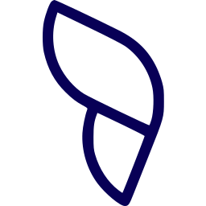

# Rodapé de PDF — código exato validado

Pressupõe a arquitetura de [`print-pages.md`](print-pages.md) (`.gh-page`
fixa 210×297mm, `@page { margin: 0 }`). Herdado da skill do Gov Hub (validado lá em agosto de 2026, depois de
duas rodadas de ajuste; ainda não validado em peça do Lab Livre) — leia "Erros já cometidos" no fim
antes de alterar valores de tamanho/posição.

Aparece em **toda página de conteúdo** (com ou sem cabeçalho de capítulo),
nunca na capa (a capa tem seu próprio rodapé pequeno, ver
[`print-cover.md`](print-cover.md)).

## O que é

Uma barra fina divisória **alinhada à margem do conteúdo** (não vai até a
borda física da página — só até onde o texto do documento também vai) e,
abaixo dela, à esquerda o **número da página** em navy bold seguido do
nome curto do documento, e à direita a borboleta do Lab Livre (ícone
isolado), em tamanho pequeno-mas-legível. O símbolo é `borboleta-blue.svg`
(azul profundo sólido), pelo mesmo motivo que o Gov Hub usa o ícone navy
no rodapé: sobriedade. Sobre fundo escuro, `borboleta-white.svg`. A
borboleta é quadrada (256×256), então com `height: 9.5mm` ela sai um
pouco mais estreita que o símbolo do Gov Hub; não compense aumentando.

## CSS

```css
.gh-footer-bar {
  position: absolute; left: 20mm; right: 20mm; bottom: 23mm;  /* mesma margem do conteúdo, NÃO left/right:0 */
  height: 2px; background: var(--border-soft);
}
.gh-footer {
  position: absolute; left: 20mm; right: 20mm; bottom: 12mm;
  display: flex; align-items: center; justify-content: space-between;
}
.gh-footer__text { font-size: 9pt; color: var(--text-muted); display: flex; align-items: baseline; gap: 10px; }  /* nota de rodapé — ver escala em print-header.md */
.gh-footer__page { font-size: 9pt; font-weight: 800; color: var(--dark-navy); font-variant-numeric: tabular-nums; min-width: 14px; }
.gh-footer__logo { height: 9.5mm; width: auto; }
```

## HTML

```html
<div class="gh-footer-bar"></div>
<div class="gh-footer">
  <span class="gh-footer__text"><span class="gh-footer__page">4</span>Nome curto do documento &middot; Nome curto do projeto/frente &middot; Lab Livre &middot; UnB</span>
  
</div>
```

## Padrão do texto (`.gh-footer__text`)

```
N   Nome curto do documento · Nome curto do projeto ou frente · Lab Livre · UnB
```

Sempre as 4 partes nessa ordem, mesmo separador (`&middot;`) entre todas.
Exemplo real: `4   Relatório de Diagnóstico · MGI · Lab Livre · UnB`.

## Número da página (`.gh-footer__page`)

Pedido do usuário em 2026-09-17 ("a paginação sumiu"): número físico da
página, em `--dark-navy` bold, à esquerda do texto, separado por 10px. É
**texto fixo digitado por você**, como tudo na paginação manual desta
skill: a capa é a página 1 (e não leva rodapé, então o primeiro número
impresso é 2, na folha de identificação, ou 2 no capítulo 01 quando não há
front matter). Toda vez que uma página entra, sai ou muda de lugar, renumere
todos os rodapés e o índice juntos (ver "Números de página são manuais" em
`print-frontmatter.md`); os dois precisam bater, confira no PDF final.

## O que varia por documento

- O número da página (um por página, sequencial, capa = 1).
- As duas primeiras partes do texto — nome curto do documento e nome curto
  do projeto/frente a que ele pertence. As duas últimas (`Lab Livre ·
  UnB`) são fixas da marca, assim como o símbolo e a barra.

## Erros já cometidos (não repita)

1. **"De ponta a ponta" não significa até a borda física da página.** A
   primeira versão usava `left:0; right:0` na barra, fazendo-a sangrar até
   a borda — o usuário corrigiu: a barra deve ir só até onde o conteúdo
   (texto, tabelas) também vai, ou seja, `left`/`right` iguais à margem do
   corpo (20mm neste caso), não zero. "De ponta a ponta" = a largura útil
   do conteúdo, não a folha inteira.
2. **Logo grande demais.** Primeira tentativa validada tinha
   `height: 15mm` — grande o suficiente para competir visualmente com o
   texto do rodapé. Reduzida para `9.5mm` a pedido do usuário. Se for
   ajustar de novo, mude em passos pequenos (1-2mm) e confira antes de
   seguir.
3. **Barra colada no texto.** A distância entre a barra (`bottom: 23mm`) e
   a linha de texto do rodapé (`bottom: 12mm`) precisa ser visivelmente
   maior que a altura de uma linha de texto — um gap de ~11mm entre as duas
   posições (não a distância literal entre os elementos, que é menor por
   causa da própria altura da barra/texto) foi o que funcionou.
4. **Símbolo cortado (caso do Gov Hub).** O ícone do Gov Hub saiu do
   Figma com o `viewBox` colado no extremo do desenho e o rasterizador
   cortava 1 unidade do arco, visível só com zoom. Quando chegarem novos
   SVGs da borboleta, confira com zoom no PDF rasterizado se as bordas do
   desenho não encostam no `viewBox`; se encostarem, dê 2 unidades de
   folga no `viewBox` antes de usar.
