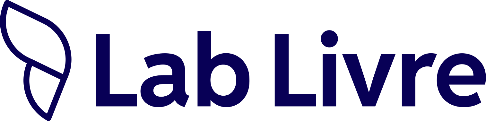

# Slides Lab Livre, variante sóbria: código exato validado

Variante **branca** dos slides, herdada da skill do Gov Hub (validada lá
com o usuário em 2026-09-18, 4 rodadas de ajuste; ainda não validada em
peça do Lab Livre). "Navy" aqui é o azul profundo `#080056`, "pêssego" é
o rosa claro `#FFE7E1`. É a linguagem do relatório em PDF
([`print-cover.md`](print-cover.md), [`print-header.md`](print-header.md),
[`print-table.md`](print-table.md)) transposta para o canvas 1920×1080:
fundo branco em todo slide, paleta só **navy + roxo + pêssego** (magenta e
rosa não entram), formas oficiais apenas na capa, na abertura de seção e
no encerramento. **Não usa os 6 templates coloridos do CDN**; eles ficam
para a variante colorida de [`slides.md`](slides.md).

## Quando usar cada variante

- **Sóbria (este arquivo):** apresentação institucional que acompanha um
  relatório de entrega, reunião com ministério/órgão, banca, comitê. É a
  preferência declarada do usuário para material institucional.
- **Colorida (`slides.md`):** evento, divulgação, aula, comunicação
  externa em que a marca precisa aparecer forte.

Se o pedido não deixar claro, pergunte ("sóbria como o relatório, ou
colorida com os templates oficiais?") antes de montar. Não misture as
duas no mesmo deck.

## Arquitetura e exportação

Mesma de `slides.md`: uma `section.gh-slide` de 1920×1080 por slide,
`@page` do mesmo tamanho com margem zero, pasta `logo/` copiada de
`references/logo/` para dentro da pasta do deck, exportação com
WeasyPrint (`python3 -m weasyprint deck.html deck.pdf`) e **conferência
visual obrigatória de todas as páginas** (rasterizar com `pypdfium2` e
olhar cada uma; ver checklist no fim).

## Tipos de slide e ordem canônica

`capa` → (`seção` → `conteúdo` × N → `ênfase` opcional) × seções →
`encerramento`. Um deck curto é `capa` → `conteúdo` × N → `encerramento`.

| Tipo | Papel | Formas | Cabeçalho | Rodapé |
|---|---|---|---|---|
| Capa | 1 por deck | quarto roxo + pílula pêssego + anel navy (as da capa do PDF) | logo azul no alto | parceiros pretos |
| Seção | abre cada seção | só um quarto roxo menor no canto | numeral + eyebrow + título roxo + barra | nenhum |
| Conteúdo (tópicos, duas colunas, cards, tabela) | corpo do deck | nenhuma | numeral + eyebrow (nome da seção) + título roxo + barra | número + símbolo |
| Ênfase (número-chave ou citação) | 1 por seção no máximo | nenhuma | igual ao conteúdo | número + símbolo |
| Encerramento | 1 por deck | as três da capa | logo azul no alto | contato + parceiros pretos |

## CSS (copie inteiro)

```css
@import url('https://fonts.googleapis.com/css2?family=Oswald:wght@500;600;700&family=Reddit+Sans:wght@400;500;600;700;800&display=swap');

:root {
  --primary-purple: #7023E8;
  --dark-navy:      #080056;
  --bg-peach:       #FFE7E1;
  --bg-white:       #FFFFFF;
  --bg-subtle:      #F8F9FA;
  --text-strong:    #202020;
  --text-body:      #2D3748;
  --text-muted:     #666666;
  --border-soft:    #E6DCFB;
  --section-color:  #080056;   /* sempre navy no PDF (print-table.md) */
  --font-family-base:    'Reddit Sans', 'Open Sans', sans-serif;
  --font-family-heading: 'Oswald', 'Reddit Sans', sans-serif;
  --radius-sm: 10px; --radius-md: 18px;
}

@page { size: 1920px 1080px; margin: 0; }
html, body { margin: 0; padding: 0; }
body { font-family: var(--font-family-base); color: var(--text-body); background: #fff; }

.gh-slide {
  position: relative; width: 1920px; height: 1080px; overflow: hidden;
  background: var(--bg-white);
  page-break-after: always; break-after: page;
}
.gh-slide:last-child { page-break-after: auto; break-after: auto; }

/* formas oficiais: só em capa, abertura de seção e encerramento */
.gh-shape { position: absolute; display: block; }

/* ============ CAPA ============ */
.gh-cover__logo { position: absolute; left: 120px; top: 100px; height: 64px; width: auto; }
.gh-cover__content { position: absolute; left: 120px; top: 400px; width: 1100px; }
.gh-cover__title {
  font-family: var(--font-family-heading); font-weight: 700; text-transform: uppercase;
  font-size: 104px; line-height: 1.04; letter-spacing: .005em;
  color: var(--dark-navy); margin: 0 0 32px; max-width: 14ch;
}
.gh-cover__subtitle { font-size: 32px; line-height: 1.5; color: var(--text-body); margin: 0; max-width: 40ch; }
.gh-cover__footer { position: absolute; left: 120px; bottom: 88px; display: flex; align-items: center; gap: 72px; }
.gh-cover__footer img { height: 64px; width: auto; }

/* ============ ABERTURA DE SEÇÃO ============ */
.gh-section__block { position: absolute; left: 120px; top: 300px; width: 1240px; }
.gh-section__num {
  font-size: 220px; font-weight: 800; line-height: 1;
  color: var(--dark-navy); opacity: .45; margin: 0 0 24px;
}
.gh-section__eyebrow {
  text-transform: uppercase; letter-spacing: 4px;
  font-size: 24px; font-weight: 700; color: var(--dark-navy); opacity: .7; margin: 0 0 16px;
}
.gh-section__title {
  font-size: 84px; font-weight: 800; line-height: 1.12;
  color: var(--primary-purple); margin: 0; max-width: 16ch;
}
.gh-section__bar { position: absolute; left: 120px; width: 1240px; top: 800px; height: 3px; background: var(--border-soft); }

/* ============ CONTEÚDO: cabeçalho ============ */
.gh-band {
  position: absolute; top: 0; left: 120px; right: 120px;
  padding: 72px 0 28px;
  border-bottom: 3px solid var(--border-soft);
  color: var(--dark-navy);
}
.gh-band__row { display: flex; align-items: center; gap: 36px; }
.gh-band__num { font-size: 96px; font-weight: 800; line-height: 1; color: var(--dark-navy); opacity: .45; min-width: 150px; }
.gh-band__eyebrow { text-transform: uppercase; letter-spacing: 3px; font-size: 20px; font-weight: 700; color: var(--dark-navy); opacity: .7; margin-bottom: 10px; }
.gh-band__title { color: var(--primary-purple); font-size: 52px; font-weight: 800; line-height: 1.15; margin: 0; }

/* corpo: top = altura do cabeçalho (~232px) + ~56px de respiro */
.gh-body { position: absolute; left: 120px; right: 120px; top: 290px; bottom: 140px; overflow: hidden; }
.gh-body h3 { font-size: 36px; font-weight: 700; color: var(--dark-navy); margin: 0 0 20px; }
.gh-body p  { font-size: 32px; line-height: 1.5; color: var(--text-body); margin: 0 0 24px; }
.gh-body ul { margin: 0; padding-left: 1.1em; }
.gh-body li { font-size: 32px; line-height: 1.5; color: var(--text-body); margin-bottom: 14px; }
.gh-body li::marker { color: var(--dark-navy); }

/* duas colunas */
.gh-cols { display: flex; gap: 80px; }
.gh-cols > div { flex: 1; min-width: 0; }

/* tabela (print-table.md, sem cartão) */
.gh-body .gh-table-caption { font-size: 26px; font-weight: 700; color: var(--section-color); margin: 0 0 16px; }
.gh-print-table { width: 100%; border-collapse: collapse; }
.gh-print-table thead th { background: var(--section-color); color: #fff; font-weight: 600; font-size: 26px; text-align: left; padding: 20px 28px; }
.gh-print-table tbody td { padding: 18px 28px; font-size: 26px; color: var(--text-body); border-bottom: 1px solid var(--border-soft); vertical-align: top; }
.gh-print-table tbody tr:last-child td { border-bottom: none; }
.gh-print-table tbody tr:nth-child(even) td { background: var(--bg-subtle); }

/* cards / callouts (editorial-report.md, contorno fino navy) */
.gh-cards { display: flex; gap: 40px; }
.gh-callout-box {
  flex: 1; min-width: 0;
  border: 2.5px solid var(--section-color); border-radius: var(--radius-md);
  padding: 36px 36px 40px;
}
.gh-icon-badge {
  width: 88px; height: 88px; border: 2.5px solid var(--section-color); border-radius: var(--radius-sm);
  display: flex; align-items: center; justify-content: center; background: #fff; margin-bottom: 22px;
}
.gh-icon-badge img { width: 60px; height: 60px; }
.gh-body .gh-callout-box__title { font-size: 22px; text-transform: uppercase; letter-spacing: 1.5px; font-weight: 700; color: var(--text-strong); margin: 0 0 8px; }
.gh-body .gh-callout-box__body { font-size: 26px; line-height: 1.45; color: var(--text-body); margin: 0; }

/* ênfase: número-chave */
.gh-body .gh-kpi { font-family: var(--font-family-heading); font-weight: 700; font-size: 260px; line-height: 1; color: var(--primary-purple); margin: 0 0 24px; }
.gh-body .gh-kpi-text { font-size: 44px; line-height: 1.35; font-weight: 500; color: var(--dark-navy); margin: 0; max-width: 26ch; }

/* citação */
.gh-quote { border-left: 6px solid var(--primary-purple); padding-left: 48px; margin: 40px 0 0; }
.gh-body .gh-quote p { font-size: 46px; line-height: 1.4; font-weight: 500; color: var(--dark-navy); margin: 0 0 24px; max-width: 30ch; }
.gh-quote cite { font-style: normal; font-size: 26px; color: var(--text-muted); }

/* rodapé (print-footer.md) */
.gh-footer { position: absolute; left: 120px; right: 120px; bottom: 44px; display: flex; align-items: center; justify-content: space-between; }
.gh-footer__page { font-size: 30px; font-weight: 800; color: var(--dark-navy); font-variant-numeric: tabular-nums; }
.gh-footer__logo { height: 52px; width: auto; }

/* ============ ENCERRAMENTO ============ */
.gh-closing__block { position: absolute; left: 120px; bottom: 210px; width: 1100px; }
.gh-closing__title { font-family: var(--font-family-heading); font-weight: 700; text-transform: uppercase; font-size: 104px; line-height: 1.04; color: var(--dark-navy); margin: 0 0 32px; }
.gh-closing__lead { font-size: 34px; line-height: 1.6; color: var(--text-body); margin: 0; }
.gh-closing__lead strong { color: var(--dark-navy); font-weight: 700; }
```

### Decisões que não mudam (validadas)

- **Numeral do cabeçalho** navy a 45 % de opacidade, **eyebrow** navy a
  70 %, **título** roxo `--primary-purple` (o único roxo do slide de
  conteúdo), **barra** de 3px `--border-soft` abaixo, alinhada às margens
  de 120px. É o `print-header.md` em escala de slide.
- **Corpo** começa em `top: 290px` (cabeçalho de ~232px + ~56px de respiro)
  e termina em `bottom: 140px`. `h3` navy, texto 32px `--text-body`.
- **Rodapé** é só o **número da página** (30px, navy, bold) à esquerda e o
  símbolo `borboleta-blue.svg` (52px) à direita. **Sem barra e sem nome
  do deck**: a primeira versão tinha a barra e o texto "deck · projeto ·
  Lab Livre · UnB" do rodapé de PDF, e o usuário pediu para
  tirar os dois e aumentar o número. Não reintroduza.
- **Tabela** igual a `print-table.md`: legenda numerada navy, header navy
  sólido, zebra `--bg-subtle`, sem cartão nem sombra.
- **Cards** são os callouts de `editorial-report.md`: contorno navy de
  2.5px, badge de ícone 88px com ícone de produto `-default` 60px do CDN,
  título uppercase pequeno e corpo 26px.
- **Número-chave** (`.gh-kpi`) em Oswald 260px **roxo**, não rosa; o rosa
  não entra na variante sóbria. Texto de apoio navy 44px.
- **Citação** com filete roxo de 6px à esquerda, texto navy 46px, autor
  em `--text-muted`.
- **Encerramento** sem "Obrigado": logo azul no alto, área livre no meio,
  contato (site em negrito navy + e-mail) no canto inferior
  esquerdo a `bottom: 210px`, parceiros abaixo. O usuário removeu o
  "Obrigado" e o GitHub de propósito, para deixar mais área livre.
- **Parceiros** na capa e no encerramento: `unb-dark-outlined.svg` e, se
  for projeto Gov Hub, `govhub-black.svg`, a 64px, nessa ordem (regra de
  `partners.md`). A marca Lab Livre fica no alto, não na linha.
- **Número de página** é texto fixo, capa = 1, seção conta mas não mostra.

## HTML de cada tipo (copie e troque só o texto)

Capa:

```html
<section class="gh-slide gh-cover">
  <!-- quarto de círculo roxo, canto inferior direito -->
  <svg class="gh-shape" viewBox="0 0 100 100" aria-hidden="true"
       style="right:-1px; bottom:-1px; width:600px; height:600px">
    <path fill="#7023E8" d="M100 100H0a100 100 0 0 1 100-100z"/>
  </svg>
  <!-- pílula pêssego, entrando pela esquerda -->
  <svg class="gh-shape" viewBox="0 0 266 100" aria-hidden="true"
       style="left:-150px; top:230px; width:430px; height:162px; ">
    <rect width="266" height="100" rx="50" fill="#FFE7E1"/>
  </svg>
  <!-- anel navy, alto à direita -->
  <svg class="gh-shape" viewBox="0 0 100 100" aria-hidden="true"
       style="right:-70px; top:90px; width:240px; height:240px; ">
    <path fill="#080056" fill-rule="evenodd"
          d="M50 0a50 50 0 1 0 0 100a50 50 0 1 0 0-100zM50 25.6a24.4 24.4 0 1 1 0 48.8a24.4 24.4 0 1 1 0-48.8z"/>
  </svg>

  
  <div class="gh-cover__content">
    <h1 class="gh-cover__title">Título da apresentação</h1>
    <p class="gh-cover__subtitle">Subtítulo ou contexto em uma ou duas linhas: evento, data, equipe responsável.</p>
  </div>
  <div class="gh-cover__footer">
    
    
  </div>
</section>
```

Abertura de seção:

```html
<section class="gh-slide gh-section">
  <svg class="gh-shape" viewBox="0 0 100 100" aria-hidden="true"
       style="right:-1px; bottom:-1px; width:420px; height:420px">
    <path fill="#7023E8" d="M100 100H0a100 100 0 0 1 100-100z"/>
  </svg>
  <div class="gh-section__block">
    <p class="gh-section__num">01</p>
    <p class="gh-section__eyebrow">Seção</p>
    <h1 class="gh-section__title">Título da primeira seção</h1>
  </div>
  <div class="gh-section__bar"></div>
</section>
```

Conteúdo, tópicos:

```html
<section class="gh-slide">
  <div class="gh-band">
    <div class="gh-band__row">
      <div class="gh-band__num">01</div>
      <div>
        <div class="gh-band__eyebrow">Título da primeira seção</div>
        <h2 class="gh-band__title">Título do slide em uma linha</h2>
      </div>
    </div>
  </div>
  <div class="gh-body">
    <h3>Subtítulo opcional em navy</h3>
    <ul>
      <li>Primeiro ponto do slide, uma frase objetiva e completa.</li>
      <li>Segundo ponto, com o mesmo tamanho de frase do anterior.</li>
      <li>Terceiro ponto. Evite passar de cinco por slide.</li>
      <li>Quarto ponto, se precisar, ainda dentro da área útil.</li>
    </ul>
  </div>
  <div class="gh-footer">
    <span class="gh-footer__page">3</span>
    
  </div>
</section>
```

Conteúdo, duas colunas:

```html
<section class="gh-slide">
  <div class="gh-band">
    <div class="gh-band__row">
      <div class="gh-band__num">01</div>
      <div>
        <div class="gh-band__eyebrow">Título da primeira seção</div>
        <h2 class="gh-band__title">Texto corrido em duas colunas</h2>
      </div>
    </div>
  </div>
  <div class="gh-body">
    <div class="gh-cols">
      <div>
        <h3>Contexto</h3>
        <p>A busca por soluções que fortaleçam a transparência e a democratização das informações públicas tem motivado, na última década, a proposição de políticas e iniciativas voltadas para a implementação dos chamados dados abertos governamentais.</p>
        <p>Nesse cenário, surge a parceria entre o órgão e o Lab Livre da UnB para implantar uma solução de software livre baseada no ecossistema Lab Livre.</p>
      </div>
      <div>
        <h3>Objetivo</h3>
        <p>Apoiar a transparência ativa e a soberania digital, provendo subsídios para o observatório por meio das frentes de trabalho apresentadas a seguir.</p>
        <ul>
          <li>Integração e qualificação de dados.</li>
          <li>Documentação e catálogo de metadados.</li>
          <li>Disponibilização em painéis e APIs.</li>
        </ul>
      </div>
    </div>
  </div>
  <div class="gh-footer">
    <span class="gh-footer__page">4</span>
    
  </div>
</section>
```

Conteúdo, cards (ícones de produto do CDN, variante `-default`, escolha pelo nome em `icons-catalog.md`):

```html
<section class="gh-slide">
  <div class="gh-band">
    <div class="gh-band__row">
      <div class="gh-band__num">01</div>
      <div>
        <div class="gh-band__eyebrow">Título da primeira seção</div>
        <h2 class="gh-band__title">Frentes de trabalho</h2>
      </div>
    </div>
  </div>
  <div class="gh-body">
    <p>Os três eixos do projeto, na ordem em que foram executados.</p>
    <div class="gh-cards">
      <div class="gh-callout-box">
        <div class="gh-icon-badge"></div>
        <div>
          <p class="gh-callout-box__title">O que é</p>
          <p class="gh-callout-box__body">Diagnóstico das bases de contratações públicas e do fluxo de dados entre os sistemas do Executivo Federal.</p>
        </div>
      </div>
      <div class="gh-callout-box">
        <div class="gh-icon-badge"></div>
        <div>
          <p class="gh-callout-box__title">Quando</p>
          <p class="gh-callout-box__body">Primeira entrega da Meta 01, base para a arquitetura de publicação dos produtos seguintes.</p>
        </div>
      </div>
      <div class="gh-callout-box">
        <div class="gh-icon-badge"></div>
        <div>
          <p class="gh-callout-box__title">Como</p>
          <p class="gh-callout-box__body">Extração via APIs públicas, modelagem em camadas (bronze, prata, ouro) e catálogo de metadados no Lab Livre.</p>
        </div>
      </div>
    </div>
  </div>
  <div class="gh-footer">
    <span class="gh-footer__page">5</span>
    
  </div>
</section>
```

Conteúdo, tabela:

```html
<section class="gh-slide">
  <div class="gh-band">
    <div class="gh-band__row">
      <div class="gh-band__num">02</div>
      <div>
        <div class="gh-band__eyebrow">Resultados e próximos passos</div>
        <h2 class="gh-band__title">Registros extraídos por tabela</h2>
      </div>
    </div>
  </div>
  <div class="gh-body">
    <p class="gh-table-caption">Tabela 1: Quantidade de registros da extração da API</p>
    <table class="gh-print-table">
      <thead><tr><th>Tabela</th><th>Registros</th><th>Domínio</th><th>Status</th></tr></thead>
      <tbody>
        <tr><td>caracteristicas_material</td><td>1.904.256</td><td>Catálogo de Materiais</td><td>Concluído</td></tr>
        <tr><td>contratos</td><td>412.880</td><td>Contratações</td><td>Concluído</td></tr>
        <tr><td>fornecedores</td><td>96.115</td><td>Cadastro</td><td>Em andamento</td></tr>
        <tr><td>licitacoes</td><td>238.407</td><td>Contratações</td><td>Em andamento</td></tr>
        <tr><td>unidades_gestoras</td><td>5.312</td><td>Estrutura</td><td>Planejado</td></tr>
      </tbody>
    </table>
  </div>
  <div class="gh-footer">
    <span class="gh-footer__page">7</span>
    
  </div>
</section>
```

Ênfase, número-chave:

```html
<section class="gh-slide">
  <div class="gh-band">
    <div class="gh-band__row">
      <div class="gh-band__num">02</div>
      <div>
        <div class="gh-band__eyebrow">Resultados e próximos passos</div>
        <h2 class="gh-band__title">Cobertura da documentação</h2>
      </div>
    </div>
  </div>
  <div class="gh-body">
    <p class="gh-kpi">87%</p>
    <p class="gh-kpi-text">das bases integradas passaram a ter documentação de colunas no catálogo de metadados.</p>
  </div>
  <div class="gh-footer">
    <span class="gh-footer__page">8</span>
    
  </div>
</section>
```

Ênfase, citação:

```html
<section class="gh-slide">
  <div class="gh-band">
    <div class="gh-band__row">
      <div class="gh-band__num">02</div>
      <div>
        <div class="gh-band__eyebrow">Resultados e próximos passos</div>
        <h2 class="gh-band__title">O que a equipe aprendeu</h2>
      </div>
    </div>
  </div>
  <div class="gh-body">
    <blockquote class="gh-quote">
      <p>"A integração das bases só se sustenta quando a documentação nasce junto com o pipeline, não depois."</p>
      <cite>Equipe de dados, Lab Livre · UnB</cite>
    </blockquote>
  </div>
  <div class="gh-footer">
    <span class="gh-footer__page">9</span>
    
  </div>
</section>
```

Encerramento (troque o e-mail pelo do responsável do projeto):

```html
<section class="gh-slide gh-closing">
  <!-- quarto de círculo roxo, canto inferior direito (espelha a capa) -->
  <svg class="gh-shape" viewBox="0 0 100 100" aria-hidden="true"
       style="right:-1px; bottom:-1px; width:600px; height:600px">
    <path fill="#7023E8" d="M100 100H0a100 100 0 0 1 100-100z"/>
  </svg>
  <!-- anel navy, alto à direita -->
  <svg class="gh-shape" viewBox="0 0 100 100" aria-hidden="true"
       style="right:-70px; top:90px; width:240px; height:240px; ">
    <path fill="#080056" fill-rule="evenodd"
          d="M50 0a50 50 0 1 0 0 100a50 50 0 1 0 0-100zM50 25.6a24.4 24.4 0 1 1 0 48.8a24.4 24.4 0 1 1 0-48.8z"/>
  </svg>
  <!-- pílula pêssego, entrando pela esquerda -->
  <svg class="gh-shape" viewBox="0 0 266 100" aria-hidden="true"
       style="left:-150px; top:230px; width:430px; height:162px; ">
    <rect width="266" height="100" rx="50" fill="#FFE7E1"/>
  </svg>

  
  <div class="gh-closing__block">
    <p class="gh-closing__lead"><strong>lablivre.unb.br</strong><br>caguiar@unb.br</p>
  </div>
  <div class="gh-cover__footer">
    
    
  </div>
</section>
```

## Zonas seguras (px no canvas 1920×1080)

| Tipo | Zona de texto | Ocupada pelas formas |
|---|---|---|
| Capa / encerramento | `x 120–1200` | quarto roxo `x > 1320, y > 480`; anel navy `x > 1750, y < 330`; pílula pêssego `x < 280, y 230–392` |
| Seção | `x 120–1360, y 300–800` | quarto roxo `x > 1500, y > 660` |
| Conteúdo / ênfase | corpo `x 120–1800, y 290–940` | nenhuma; o rodapé fica abaixo de `y 940` |

## Armadilhas do WeasyPrint (já cometidas neste template)

1. **`currentColor` e `transform` em SVG inline não funcionam.** O
   snippet de `print-cover.md` (que usa `fill="currentColor"` +
   `color:` no `style` + `rotate(180deg)`) foi validado no Chrome; no
   WeasyPrint a pílula e o anel saíram **pretos** e o quarto roxo sumiu.
   Nos slides o `fill` é literal (`#7023E8`, `#080056`, `#FFE7E1`) e o
   quarto já é desenhado no canto inferior direito
   (`d="M100 100H0a100 100 0 0 1 100-100z"`), sem transform.
2. **Especificidade:** `.gh-body p` (0,1,1) vence `.gh-kpi` (0,1,0), e o
   número-chave saiu com 32px. Todo componente com `p` dentro do corpo é
   declarado como `.gh-body .gh-kpi`, `.gh-body .gh-quote p`, etc.
3. **Flex aninhado** (card em `flex-direction: column` dentro de
   `.gh-cards` flex) calculou altura errada e o texto vazou da borda. O
   card é bloco normal; só `.gh-cards` e `.gh-cols` são flex.
4. **Rodapé em flex** quebrava o texto em duas linhas; hoje ele só tem o
   número, mas se voltar a ter texto use `white-space: nowrap`.

## Checklist de conferência visual

(1) número de páginas do PDF = número de `.gh-slide`; (2) as três formas
da capa e do encerramento estão nas cores certas (roxo, pêssego, navy;
nada preto); (3) título do cabeçalho em uma linha; (4) corpo dentro de
`y 290–940`; (5) número-chave grande (não 32px); (6) cards com o texto
dentro da borda; (7) só um slide de ênfase por seção.

## Histórico

- **2026-09-18:** v1 com barra + texto de rodapé do PDF e "Obrigado" no
  encerramento; o usuário pediu para tirar barra e nome do deck e aumentar
  o número (v2), depois remover "Obrigado" e GitHub e descer o contato
  (v3, aprovada: "ficou ótimo").
